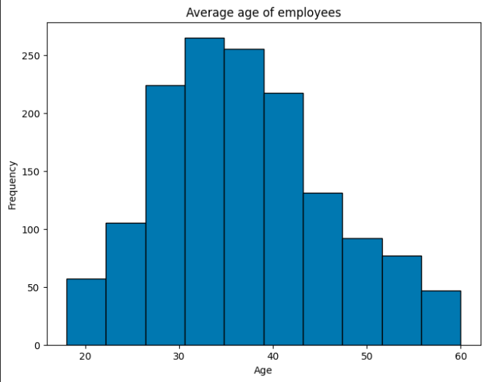
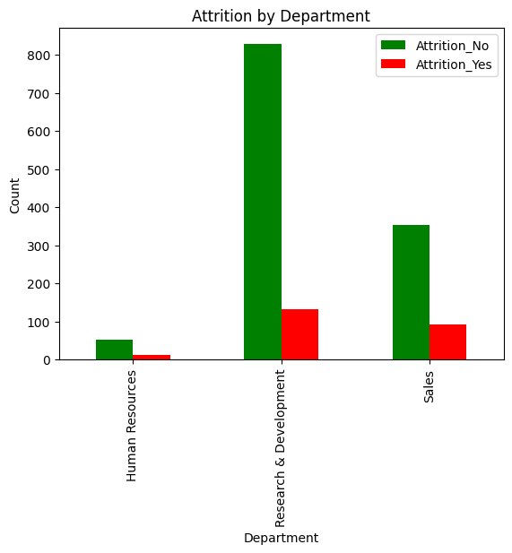

# IDS-706 Data Engineering Assignment
## Project 4 : Gitlab/Github Actions Matrix Build for Multiple Python Versions

#### Status(CI/CD) badge for building multiple python versions

------
### Updated ###
The structure of this project is same as the first individual project. The only change is python stallation is varied as follows
python-version: [3.7, 3.8, 3.9, 3.11]

### Requirements
The project structure must include the following files:

* ***Jupyter Notebook*** with:
    - Cells that perform descriptive statistics using Polars or Panda.
    - Tested by using nbval plugin for pytest
* ***Makefile*** with the following:
    - Run all tests (must test notebook and script and lib)
    - Formats code with `Python black` Links to an external site.
    - Lints code with `Ruff` Links to an external site.
    - Installs code via: pip install -r requirements.txt
* ***main.py*** to run functions 
* ***test_main.py*** to test script
* ***requirements.txt***
* Gitlab Actions performs all four Makefile commands with badges for each one in the README.md
---------
### Demo video
[Click Here For Demo](https://www.youtube.com/watch?v=6nCP6vfzQdU)
--------------
### Analysis
Dataset : [HR.csv](HR.csv) 
 - The data used in this analysis was provided by IBM and was originally created to study employee turnover.
 - From the available variables, I specifically focused on the "Age" at retirement.
 - Calcuated mean, median, standard Deviation and so on 

Functions :
- `explore data` : Use `describe` to do exploratory data analysis 
- `calculate statistics` : compute the mean(`mean`), median(`median`), standard deviation(`std`) of age
- `plot_age_histogram` : Plot a histrogram to visualize the age distribution of all employees. 
- `plot_attrition_pie_chart` : Create a plot `pie chart` to illustarte the overall attirition. 
- `plot_attrition_by_department` : Create a plot `bar chart` to analyze attrition by departments.

#### Summary Statistics
-----------

#### Attrition analysis
-----------

\
\